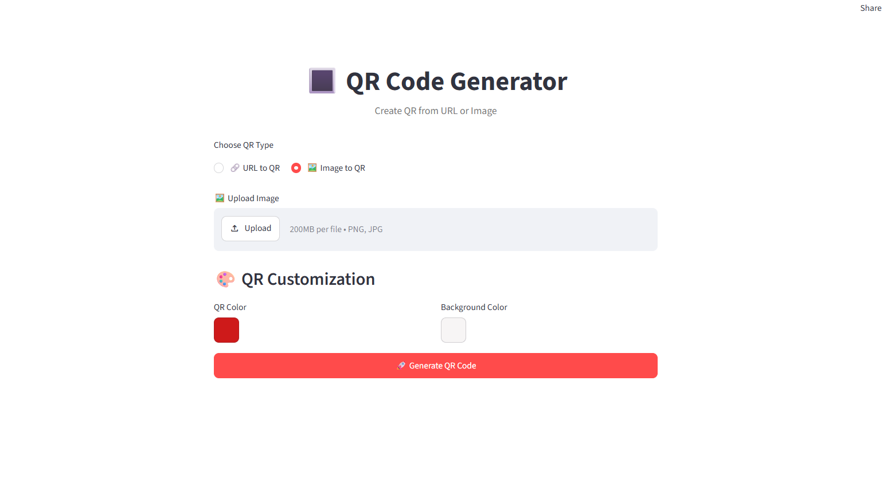
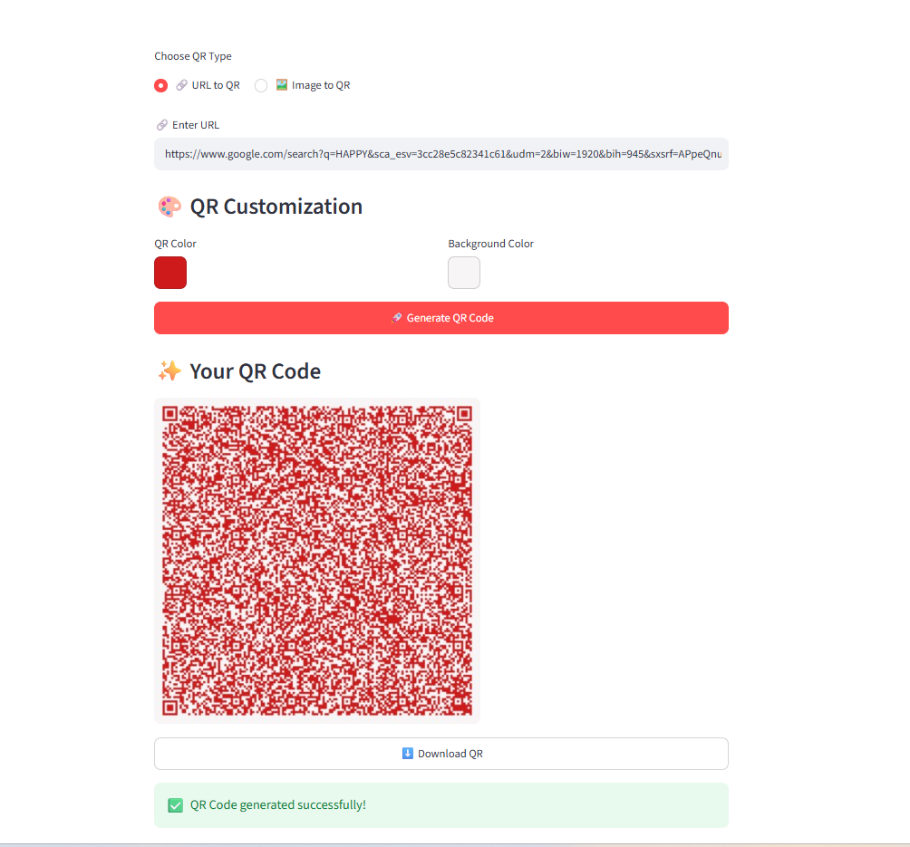

# 🔳 QR Code Generator

A simple and user-friendly QR Code Generator built with **Python** and **Streamlit**.

## 🚀 Live Demo

👉 [Open QR Code Generator](https://createqrimg.streamlit.app/)

## ✨ Features

- 🔗 Generate QR code from a URL
- 🖼️ Generate QR code from an image
- 📥 Download generated QR code
- 🎨 Simple and clean user interface
- ⚡ Fast QR code generation
- 🌐 Built with Streamlit

## 🛠️ Technologies Used

- Python
- Streamlit
- QRCode
- Pillow

## 📸 Screenshots

### QR Code Generator



### Generated QR Code



## 📂 Project Structure

```text
Day-01-QR-Generator/
│
├── app.py
├── requirements.txt
├── .gitignore
├── README.md
│── QrGen.png
│── QrGen1.png
